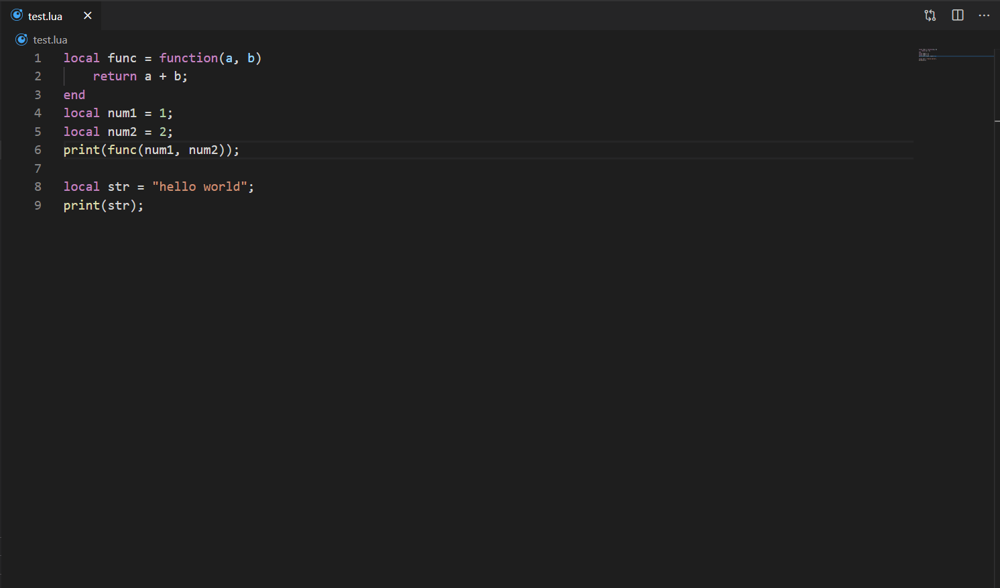

# LuaBytecodeViewer README

A vscode extension to help you view lua bytecode.

## Features
right click in lua file(or select some code, which will only compile selection):   



also you can run command `View Lua Bytecode`;

## Extension Settings

config field: 
* `luabytecodeviewer.luaDir`: the dir of lua, if nil, will directly use `luac`, which need add lua dir to your PATH

config example: 
``` json
"luabytecodeviewer.luaDir": "C:\\Program Files\\Lua\\lua-5.3.4_Win64_bin"
```

-----------------------------------------------------------------------------------------------------------

**Enjoy!**
