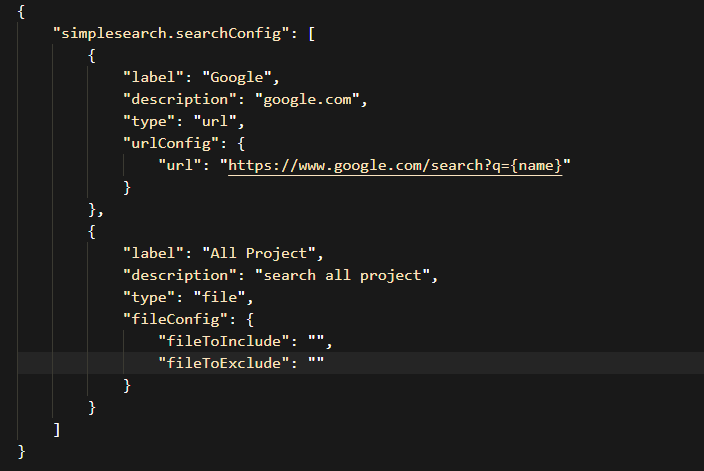

# SimpleSearch 

A vscode extension to help you quick search things in vscode.

## How-to-Use

* Through command palette: 
    `ctrl + shift + p` and input `simplesearch`

* Through keyboard shortcut: 
    `ctrl + '` on win/linux, and `cmd + '` on mac  
    if you already selected some text, extension will quick search use that text, or you need input something to search

## Extension Settings

You can configure quick search urls in your settings, like: 

## Release Notes

### 0.0.2
Support search in project files

### 0.0.1

Initial release

-----------------------------------------------------------------------------------------------------------

**Enjoy!**
